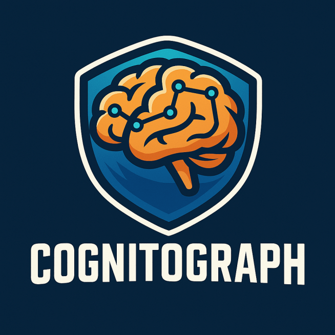

# CognitoGraph



CognitoGraph is a unified Python framework for multimodal reasoning and knowledge representation. It integrates a local large language model (LLM) via `ollama.py`, a vision model using Hugging Face Transformers (CLIP), a graph-based knowledge store using NetworkX, and a semantic search engine powered by txtai. The framework is designed to dynamically augment a knowledge graph with both textual and visual data, making it ideal for intelligent agent applications and advanced reasoning tasks.

## Features

- **Local LLM Integration:** Leverages `ollama.py` for simple, efficient local LLM interactions.  
- **Vision Model Integration:** Uses Hugging Face Transformers (CLIP) to extract image embeddings.  
- **Graph-Based Knowledge Representation:** Utilizes NetworkX to create, manage, and query a multimodal knowledge graph.  
- **Semantic Search:** Implements semantic search over text data with txtai.  
- **Dynamic Graph Augmentation:** Automatically extracts and integrates entities and relationships from text and images.  
- **Modular Design:** Clean, modular code structure for easy maintenance and extensibility.

## Repository Structure

```
CognitoGraph/
├── README.md
├── logo.png
├── requirements.txt
├── main.py
├── cognitograph.py
└── modules
    ├── __init__.py
    ├── llm_module.py
    ├── vlm_module.py
    ├── knowledge_graph.py
    ├── semantic_search.py
    └── augmentation.py
```

## Installation

1. **Clone the Repository:**

   ```bash
   git clone https://github.com/yourusername/CognitoGraph.git
   cd CognitoGraph
   ```

2. **Create a Virtual Environment (Optional but Recommended):**

   ```bash
   python -m venv venv
   source venv/bin/activate   # On Windows use: venv\Scripts\activate
   ```

3. **Install Dependencies:**

   ```bash
   pip install -r requirements.txt
   ```

## Usage

The main entry point is `main.py`, which demonstrates the core functionalities of the framework:

- Adding nodes with textual and (optionally) visual data.  
- Querying the LLM for text completions.  
- Performing semantic search over indexed documents.  
- Dynamically augmenting the knowledge graph with new entities.  
- Visualizing the current state of the knowledge graph.

To run the example, execute:

```bash
python main.py
```

## Module Overview

- **`modules/llm_module.py`**  
  Implements the LLM interface using `ollama.py` to generate text completions and handle multi-turn conversations.

- **`modules/vlm_module.py`**  
  Integrates a vision model (CLIP) from Hugging Face Transformers to process images and extract embeddings.

- **`modules/knowledge_graph.py`**  
  Provides functionality to build and manage a knowledge graph using NetworkX.

- **`modules/semantic_search.py`**  
  Implements semantic search functionality using txtai to index and query text-based node content.

- **`modules/augmentation.py`**  
  Contains methods to dynamically augment the knowledge graph by extracting entities and relationships from text and images.

- **`cognitograph.py`**  
  Serves as the unified interface that integrates all the modules together.

## Contributing

Contributions are welcome! If you'd like to improve CognitoGraph or add new features, please fork the repository and submit a pull request with your changes.

## License

This project is licensed under the MIT License. See the [LICENSE](LICENSE) file for details.

## Acknowledgments

This project builds upon the ideas presented in the CognitoGraph proposal for multimodal knowledge reasoning. Special thanks to the maintainers of Ollama, Hugging Face Transformers, NetworkX, and txtai for their excellent tools and libraries.
